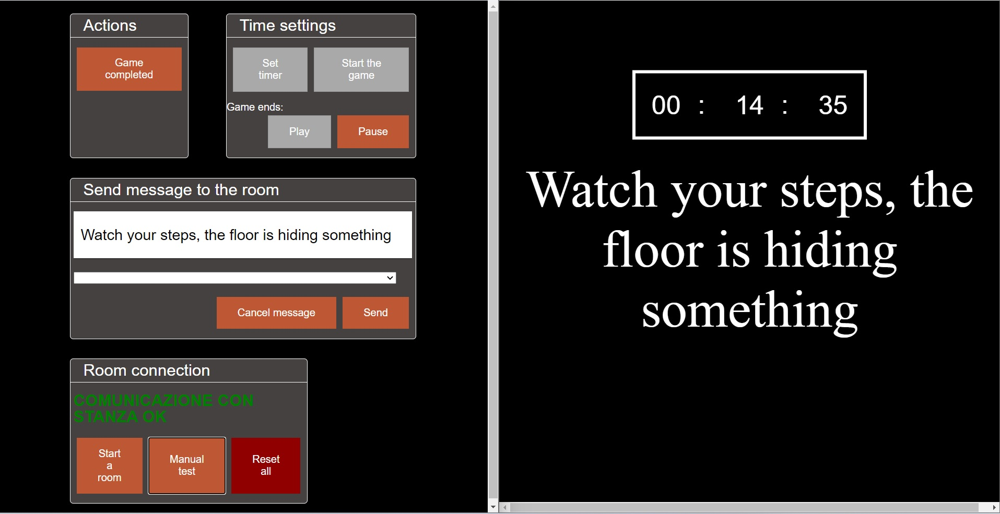

# escape_room_manager
Control room SW for real-life escape room games.
SW used in {1} real escape room, {53} sessions.
Let me know if the counters should be updated :)



# Getting started

Tested on Linux and Windows. Python 3.10

### Install

``` bash
pip3 install -r requirements.txt
```

### Run

On Linux run in the console

``` bash
python3 srv_manager.py 1
```

On Windows change the path on the escape.bat file. Then double click it

## Contributing
Any contributions you make are greatly appreciated.
Feel free to write to me!
